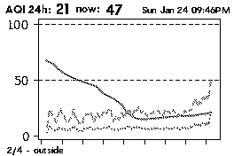
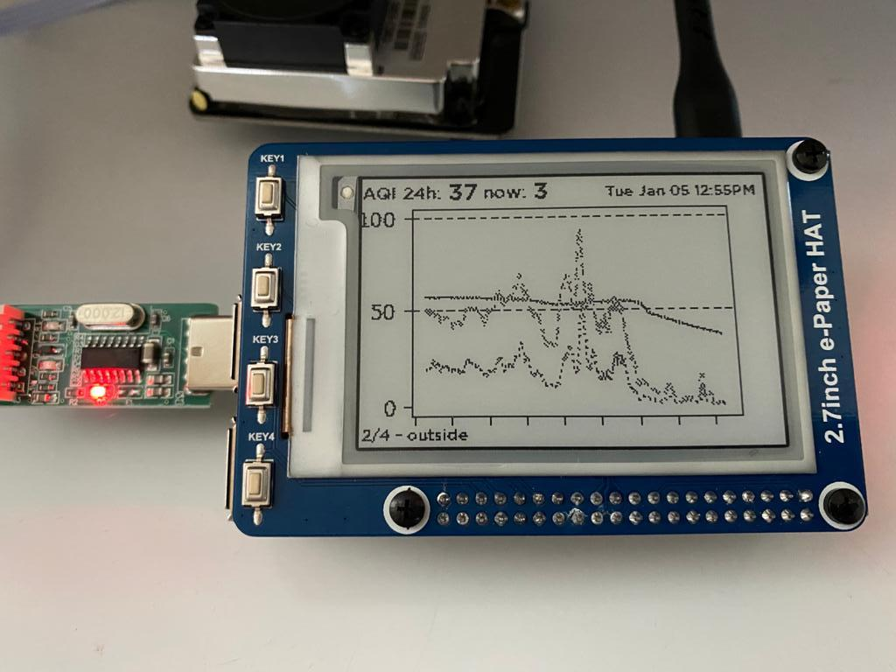

# Airmon
This project consists of sensing code, a web server to serve the recorded data values, as well as a small script to drive an e-ink display. In my case I have one indoor sensor and one outdoor sensor, both driven by different raspberry pis. The inside sensor also drives an e-ink display. The keys on the e-ink display select which sensor's graph to view.



## Hardware
- A Raspberry Pi - I used a 3 B+ since it has full-size USB ports
- An SD card and power supply (for the pi)
- A [SDS011 Nova PM sensor](https://www.amazon.com/DEVMO-Precision-Quality-Detection-Compatible/dp/B0899V46SS/ref=sr_1_2?dchild=1&keywords=SDS011&qid=1611473759&sr=8-2)
- I'm using a [Waveshare 2.7" e-Paper HAT](https://www.amazon.com/2-7inch-HAT-Resolution-Electronic-Communicating/dp/B075FQKSZ9) (optional, if you want a phsyical display in additon to a web page)

## Sensing / Serving
### Code
- `app/sense.py` - runs indefinitely, measuring air once a minute, taking 3 samples and writing them to disk
  `output/samples.csv`
  `static/eink_output.png`
- `app/web.py` - flask web service that provides an svg graph, as well as a png for use on an e-ink display
- `services/...` - systemd service definitions to allow restarting your pis without having to log in to start up the various services

```
sudo apt-get install libatlas-base-dev
sudo apt-get install libopenjp2-7
sudo apt install libtiff5
pip install wheel
cd ~/code && git clone git@github.com:ikalchev/py-sds011.git && cd py-sds011 && pip install .
pip install -r requirements.txt
```

## E-Ink Display
- `eink/display.py` - consumes static/eink_output.png as well as summary information provided by the above web service and responds to key presses to show different graphs - e.g. inside / outside
  note: you'll want to update the indoor/outdoor URLs so as to display graphs from other sensors
- [waveshare github](https://github.com/waveshare/e-Paper/blob/master/RaspberryPi_JetsonNano/python/readme_rpi_EN.txt)
```
git clone git@github.com:waveshare/e-Paper.git
pip install e-Paper/RaspberryPi_JetsonNano/python
pip install -r eink/requirements.txt
```

## Services 
```
sudo cp airmon-web.service /lib/systemd/system/airmon-web.service
sudo systemctl daemon-reload
sudo systemctl enable airmon-web.service
sudo systemctl start airmon-web.service
sudo systemctl status airmon-web.service

sudo cp airmon-sense.service /lib/systemd/system/airmon-sense.service
sudo systemctl daemon-reload
sudo systemctl enable airmon-sense.service
sudo systemctl start airmon-sense.service
sudo systemctl status airmon-sense.service

sudo cp airmon-eink.service /lib/systemd/system/airmon-eink.service
sudo systemctl daemon-reload
sudo systemctl enable airmon-eink.service
sudo systemctl start airmon-eink.service
sudo systemctl status airmon-eink.service
```



## Credits:
- I used a very similar project detailed at [https://mjrobot.org](https://mjrobot.org/2019/08/22/sensing-the-air-quality/) extensively to get started on my this project 
- I am using [Pier Sans](https://pangrampangram.com/products/pier-sans?variant=32840647540790) in this project for my own personal, non-commercial use
